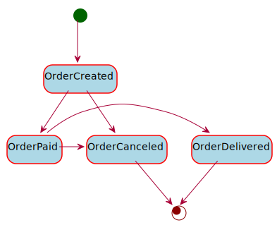

# [projects](http://idugalic.github.io/projects)/axon-statemachine-demo

This demo application demonstrate the usage of inheritance and polymorphism for making the concept of the finite state machine more explicit in your design.

### Procedural way
Take for example the concept of `Order` which is demonstrated in this example. The `Order` aggregate usually transition through many states, lets name some: NEW/CREATED, PAYED, DELIVERED. 
The intuitive approach that comes into mind first is to handle states & transitions through simple `if else`. 
But this approach does not scale, with every new state / transition addition / deletion, you need to change the big block of `if else / switch` statements that drive the whole logic.

### `State` pattern
State pattern is one of the behavioural design patterns devised by Gang Of Four. In this pattern, the concerned object holds internal state which can change & the object’s behaviour changes accordingly.
This pattern is better than the basic `if else / switch` based approach in the way that here you think about decomposing your application process into states & divide behaviours into multiple states, but since transitions are implicitly handled by states themselves, this method is not scalable and in real life you might end up violating `Open Closed — Open for extension & closed for Modification`.

### Finite State Machines
Finite State Machines (FSM, or in the context of this post, simply "State Machines") are a methodology for modeling the behavior of an entity with an established lifecycle. The lifecycle is defined by an enumerated set of states known at the time of implementation (this is where the term "finite" comes from).

- For our `Order` we will use `Order*Created*` state aggregate. This is initial state and adding items to an order (for example) can only happen in this state. You are able to Cancel, and transit to `Order*Canceled*`.

- Each state can transition between zero-or-more possible states, including returning to previous states. State transitions are executed by external stimuli (commands/events).

- From `Order*Created*` you can transition to `Order*Payed*`. In `Order*Payed*` state you should not be able to add more items to the order, so these command handlers will be omitted in this case. You are able to Cancel, and transit to `Order*Canceled*`

- From `Order*Payed*` you can transition to `Order*Delivered*`. In `Order*Delivered*` state you should NOT be able to add more items to the order, so these command handlers will be omitted in this case. You are NOT able to Cancel (`OrderCancellationRefusedEvent`)



```puml
@startuml
skinparam state {
  StartColor DarkGreen
  EndColor DarkRed
  BackgroundColor LightBlue
  BackgroundColor<<Warning>> Olive
  BorderColor Red
}
hide empty description

[*] --> OrderCreated
OrderCreated --> OrderPaid
OrderCreated --> OrderCanceled
OrderPaid -> OrderDelivered
OrderPaid -> OrderCanceled
OrderDelivered --> [*]
OrderCanceled --> [*]
@enduml
```

The [Finite-State-Machine pattern](https://en.wikipedia.org/wiki/Finite-state_machine) is a formalization of an entity's life cycle and thus, forces us to think about our models in terms of behavior. The consequence is that we tend to design better systems when we use the pattern. The process of discovery helps us identify the behaviors of each state. Behaviors expand into actions or "intents" clients can request from the entity. State transitions indicate events that need to be published.

Axon Framework fits very good here. Some of the Axon features used in this demo are:

 - [aggregate polymorphism](https://docs.axoniq.io/reference-guide/implementing-domain-logic/command-handling/aggregate-polymorphism)
 - [aggregate creation from another aggregate](https://docs.axoniq.io/reference-guide/implementing-domain-logic/command-handling/aggregate-creation-from-aggregate)
 - [`markDeleted()`](https://docs.axoniq.io/reference-guide/implementing-domain-logic/command-handling/aggregate#aggregate-lifecycle-operations)
 
Each transition will mark the current aggregate (state) instance as deleted and it will create a new instance of the next aggregate (state).
Transition is explicit, and Axon may improve this by extending the API with transition concept, to make our life easier in the future.
 
## Development

This project is driven using [maven].

### Run Axon Server

You can [download](https://download.axoniq.io/axonserver/AxonServer.zip) a ZIP file with AxonServer as a standalone JAR. This will also give you the AxonServer CLI and information on how to run and configure the server.

Alternatively, you can run the following command to start AxonServer in a Docker container:

```
$ docker run -d --name axonserver -p 8024:8024 -p 8124:8124 axoniq/axonserver
```

### Run locally

You can run the following command to start your project locally:

```
$ ./mvnw spring-boot:run
```

### Run tests

This project comes with some rudimentary tests as a good starting
point for writing your own. Use the following command to execute the
tests using Maven:

```
$ ./mvnw test
```

## References

- https://rclayton.silvrback.com/use-state-machines
- https://en.wikipedia.org/wiki/Finite-state_machine
---
Created with :heart: by [Ivan Dugalic](https://idugalic.github.io/)

[maven]: https://maven.apache.org/ (Maven)
[axon]: https://axoniq.io/ (Axon)
